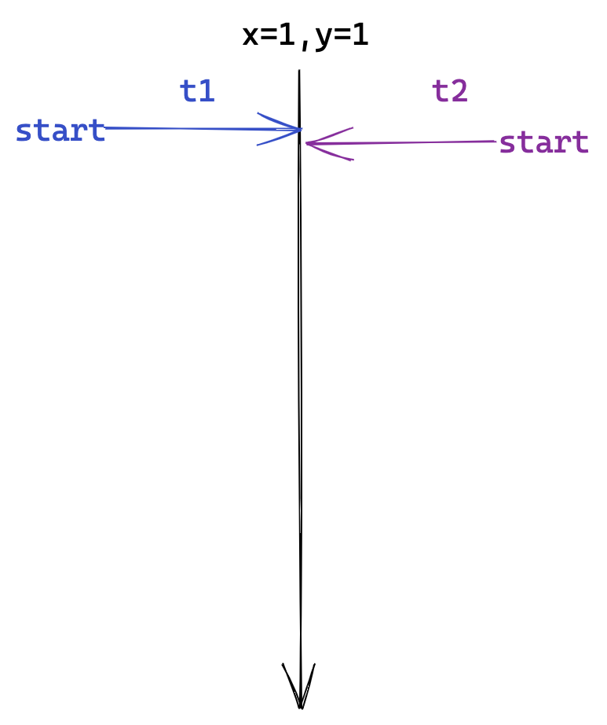
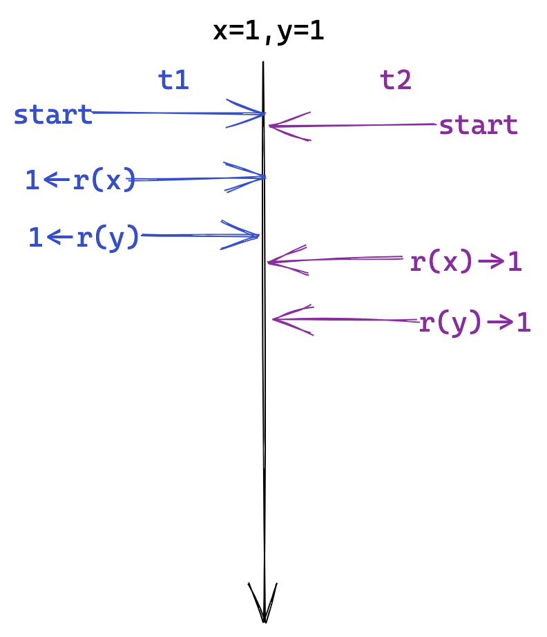
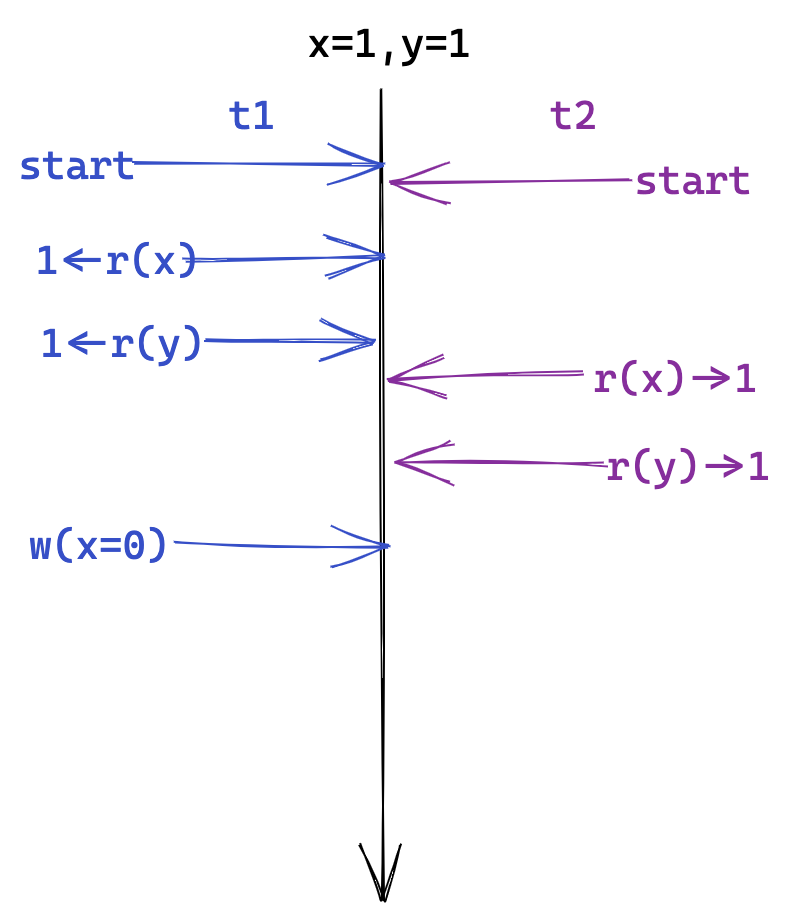
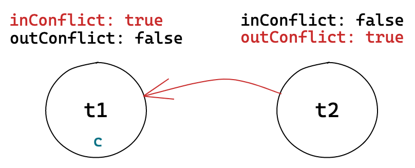
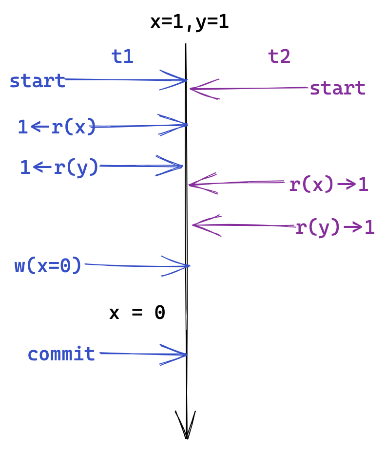
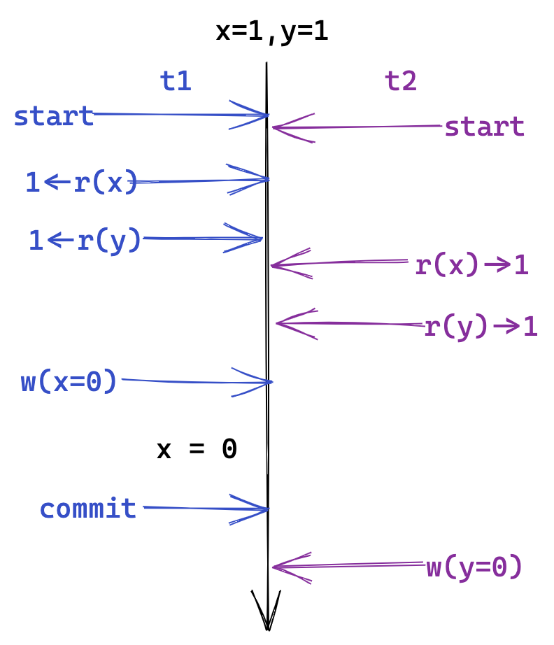

class: middle, center, inverse
# MVTO+Percolator

.pull-right.red.footnote[杨韬]

---

- Snapshot Isolation
- Serializable Snapshot Isolation
- Write Snapshot Isolation
- Multi-Version Timestamp Ordering

---

class: center, middle, inverse
## Snapshot Isolation

---

### ANSI SQL Isolation levels


| levels           | Dirty reads | Lost updates | Non-repeatable reads | Phantoms |
| ---------------- | :---------: | :----------: | :------------------: | :------: |
| Read Uncommitted |      -      |      -       |          -           |    -     |
| Read Committed   |      +      |      -       |          -           |    -     |
| Repeatable Read  |      +      |      +       |          +           |    -     |
| Serializable     |      +      |      +       |          +           |    +     |

```
'+': not possible
'-': possible
```

???
Read uncommitted 可能出现一个事务读到另外一个事务未提交的修改。
Read committed 不能保证重复读的结果相同。
Repeatable reads 可能出现幻读（Phantom reads）的情况。比如一个事务 T 按照某个条件 c 读到了一个集合 A。当事务 T 重复按照条件 c 读到一个集合 B，A 和 B 不一定相同。因为在两次重复的间隔中可能有别的事务插入或者删除了满足条件 c 的数据项。

Unrepeatable reads 与 Phantom reads 的区别：Unrepeatable reads 是数据项的更新导致的，而 Phantom reads 是数据项的删除和插入导致的。

Postgre 没有 Read uncommitted 这一等级。最早的 Postgre 最高的隔离等级是 Snapshot Isolation。后来加上将要讲到 SSI ，Postgre 才实现了 Serializable 的隔离。
???

---
layout: true
### Snapshot Isolation

---

SI 会保证所有的 read 读到的是一个 consistent snapshot 。

--

- 一个事务只能读到在它开始之前已经提交的数据(`T read(x) => TS(x) < T.start_timestamp`)
  - ~~Dirty reads~~
  - ~~Non-repeatable reads~~
  - ~~Phantoms~~
--

- *First-Committer-Wins*: 如果两个并发事务的写集合冲突，只有先提交的事务才能提交成功
  
  - ~~Lost updates~~

???
- reads are never delayed because of concurrent txns’ writes,
- reads never cause delays in a writing txn.

SI 不会出现 Phantom reads：
- 新插入的数据项的时间戳会比已经读过该数据项的事务的时间戳大，所以按条件重复读不会读到新的数据项
- 被删除的数据项在事务的Snapshot中有备份，所以按条件重复读依然能读到
???

---

.center.red[`SI == Serializable?`]
--

.center[


**[<u>A Critique of ANSI SQL Isolation Levels</u>](https://www.microsoft.com/en-us/research/wp-content/uploads/2016/02/tr-95-51.pdf)**
]


---
layout: false

### Skew Write
.left-grid[
```
x = 1, y = 1

t1:
	if x+y==2 then x -= 1
t2:
	if x+y==2 then y -= 1

t1: r(x)r(y)w(x)
t2: r(x)r(y)w(y)
```
```
Serial:
1) t1, t2 -> x = 0, y = 1
2) t2, t1 -> x = 1, y = 0
```
]
--

.right-grid[
```
SI:
r1(x)r1(y)r2(x)r2(y)w1(x)w2(y)
  -> x = 0, y = 0
```

]

???
出现的根本原因: SI 没有解决读写冲突的问题

证明一个算法是否是可串行化的，应该使用冲突可串行化的理论推导，而不应该使用并发问题去检验。因为一个是充分条件而另一个只是必要条件。
???

---
layout: true
### Read-Write Conflicts

---
**Conflicts:**

Two actions of different txns conflict, only if
1. They Involve the same database element, and
2. At least one is a write.

--

**Skew write:**
```
s: r1(x)r1(y)r2(x)r2(y)w1(x)w2(y)

rw-conflict: (r2(x), w1(x)), (r1(y), w2(y))
```

---

**Skew write:**
```
s: r1(x)r1(y)r2(x)r2(y)w1(x)w2(y)
```

**Serialization Graph:**

.center[

A schedule is serializable iff there is no cycle in its serialization graph.
]

???
Serialization Graph 中，每个冲突是个单向的边，从先执行冲突项的事务指向后指向的事务。
如果 Serialization Graph 有环表示这个调度不是 Serializable 的。

一条边从t1指向t2表明，调度应该等效于t1在t2之前执行。这就构成了一种依赖关系。
???

---

- For SI, any cycle must have at least two consecutive .red[rw-anti-dependency] edges.

.center[
</img>

Generalized dangerous structure
]

???
只有有了这个dangerous structure才会可能出现环。
rw-anti-dependency 之所以叫 anti-dependency 是因为读操作可能是晚于写的
???

--

Serializable Snapshot Isolation:
- detect dangerous structures,
- and then abort one of the txns involved.

---
layout:false

class: center, middle, inverse
## SSI: Serializable Snapshot Isolation

---
layout: true
## SSI

---

**Txn**:

- inConflict: rw-anti-dependency 指入
- outConflict: rw-anti-dependency 指出

.center[</img>]
```
t1.inConflict = true
t2.outConflict = true
t3.inConflict = true
t3.outConflict = true
```

???
in: 有一个边指向该事务
out：一个边从该事务指出
???

---
### Skew Write

.left-grid[ </img>]
.right-grid[ </img>]

---
count: false
### Skew Write

.left-grid[ </img>]
.right-grid[ </img>]

---
count: false
### Skew Write

.left-grid[ </img>]
.right-grid[ </img>]

---
count: false
### Skew Write

.left-grid[ </img>]
.right-grid[ </img>]

---
count: false
### Skew Write

.left-grid[ </img>]
.right-grid[ </img>]

---
count: false
### Skew Write

.left-grid[ </img>]
.right-grid[ </img>]

---
count: false
### Skew Write

.left-grid[ </img>]
.right-grid[ </img>]

---

- 为了检测 rw-anti-dependency，需要比较复杂的锁表；

- 每个事务都必须能访问别的所有事务的 inConflict 和 outConflict。

???
不适合分布式的场景使用
???

---

layout: false
class: middle, center, inverse
## WSI  (Write Snapshot Isolation)

---
layout: true
## WSI
---

.red[[A Critique of Snapshot Isolation](https://dl.acm.org/doi/10.1145/2168836.2168853)]:

- WSI(write snapshot isolation): detect read-write conflicts

- RSI(read snapshot isolation): detect write-write conflicts

**Read-write conflict detection is sufficient for providing serializability.**

---

.center[]

$R_r$: 事务 $txn_i$ 的写集合

$R_w$: 事务 $txn_i$ 的读集合


???
论文中给出的 WSI 实现是OCC的方法，即判断读集合在事务执行期间是否被修改。
这时需要锁上所有的读集合，避免其他事务的修改。（事务提交时退化成了完全的两阶段锁）
???

---

- 需要维护读集合；
- 在提交过程中，检查读集合是否被更新的期间，需要“锁”住读集合。

---
layout: false
class: middle, center, inverse
## MVTO  (MVCC + Timestamp Ordering)

---

layout: true
## MVTO

---


### Reads

$ X = {x_0,...,x_i,...x_n} $ where $ TS(i)<TS(i+1) $

T $r(x)$:

- 从 $X$ 中找到最大的 $j$，使得 $WT(x_j) \lt TS(T)$:

  - $RT(x_j)=max(RT(x_j),\ TS(T))$，

  - 返回 $x_j$ 作为 $r(x)$ 的结果。

---

### Writes

$ X = {x_0,...,x_i,...x_n} $ where $ TS(i)<TS(i+1) $

T $w(x)$:

- 从 $X$ 中找到最大的 $j$，使得 $WT(x_j) \lt TS(T)$
  - 如果 $RT(x_j) > TS(T)$：abort and restart T。
  - otherwise：
      - 创建 $x$ 的新版本 $x_{j+1}$，并插入 $j$ 之后。
      - $WT(x_{j+1}) = TS(T)$。

---
layout: false
## SSI MVTO WSI

|      | 冲突检测 | 只读事务                    |
| ---- | -------- | --------------------------- |
| SSI  | rw, ww   | 可能被阻塞,可能阻塞别的事务 |
| WSI  | rw       | 不被阻塞,也不阻塞别的事务   |
| MVTO | rw       | 不被阻塞,可能阻塞别的事务   |


???
MVTO 理论上的并发度可能小于另外两个算法，但是算法本身最适合分布式应用。
WSI 理论上可以有很高的并发度，但是实现上很复杂，特别是检测read set是否被更新。
???

???
MVTO 更加适用分布化：判断冲突的信息本身是分布化的
???
