class: middle, center, inverse
# Serializable Snapshot Isolation

.pull-right.red.footnote[杨韬]

---
.center[
<a href="https://dl.acm.org/doi/10.1145/1071610.1071615">
  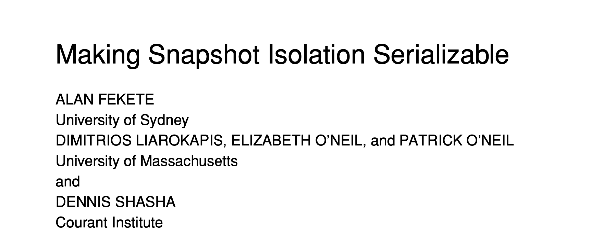
</a>
<a href="https://dl.acm.org/doi/10.1145/1376616.1376690">
  
</a>
]


---

### Contents

- Snapshot Isolation
- SSI
- SSI V.S. MVTO

---

class: center, middle, inverse
## Snapshot Isolation

---

### ANSI SQL Isolation levels


| levels           | Dirty reads | Lost updates | Non-repeatable reads | Phantoms |
| ---------------- |:-----------:|:------------:|:--------------------:|:--------:|
| Read Uncommitted | -           | -            | -                    | -        |
| Read Committed   | +           | -            | -                    | -        |
| Repeatable Read  | +           | +            | +                    | -        |
| Serializable     | +           | +            | +                    | +        |

```
'+': not possible
'-': possible
```

???
Read uncommitted 可能出现一个事务读到另外一个事务未提交的修改。
Read committed 不能保证重复读的结果相同。
Repeatable reads 可能出现幻读（Phantom reads）的情况。比如一个事务 T 按照某个条件 c 读到了一个集合 A。当事务 T 重复按照条件 c 读到一个集合 B，A 和 B 不一定相同。因为在两次重复的间隔中可能有别的事务插入或者删除了满足条件 c 的数据项。

Unrepeatable reads 与 Phantom reads 的区别：Unrepeatable reads 是数据项的更新导致的，而 Phantom reads 是数据项的删除和插入导致的。

Postgre 没有 Read uncommitted 这一等级。最早的 Postgre 最高的隔离等级是 Snapshot Isolation。后来加上将要讲到 SSI ，Postgre 才实现了 Serializable 的隔离。
???

---
layout: true
### Snapshot Isolation

---
SI guarantees that all reads made in a txn will see a consistent snapshot of the database.

```
Txn:
	start_timestamp
	commit_timestamp
```
--

- When a txn T1 read x, T1 gets the newest version of x created by a committed txn T2 where `T2.commit_timestamp < T1.start_timestamp`.
  - ~~Dirty reads~~
  - ~~Non-repeatable reads~~
  - ~~Phantoms~~
--

- *First-Committer-Wins*: a txn cannot modify an item if a concurrent txn has already modified it.
  
  - ~~Lost updates~~

???
- reads are never delayed because of concurrent txns’ writes,
- reads never cause delays in a writing txn.

SI 不会出现 Phantom reads：
- 新插入的数据项的时间戳会比已经读过该数据项的事务的时间戳大，所以按条件重复读不会读到新的数据项
- 被删除的数据项在事务的Snapshot中有备份，所以按条件重复读依然能读到
???

---

.center.red[`SI == Serializable?`]
--

.center[


**[<u>A Critique of ANSI SQL Isolation Levels</u>](https://www.microsoft.com/en-us/research/wp-content/uploads/2016/02/tr-95-51.pdf)**
]


---
layout: false

### Skew Write
.left-grid[
```
x = 1, y = 1

t1:
	if x+y==2 then x -= 1
t2:
	if x+y==2 then y -= 1

t1: r(x)r(y)w(x)
t2: r(x)r(y)w(y)
```
```
Serial:
1) t1, t2 -> x = 0, y = 1
2) t2, t1 -> x = 1, y = 0
```
]
--

.right-grid[
```
SI:
r1(x)r1(y)r2(x)r2(y)w1(x)w2(y)
  -> x = 0, y = 0
```

]

???
出现的根本原因: SI 没有解决读写冲突的问题

证明一个算法是否是可串行化的，应该使用冲突可串行化的理论推导，而不应该使用并发问题去检验。因为一个是充分条件而另一个只是必要条件。
???

---
layout: true
### Read-Write Conflicts

---
**Conflicts**

Two actions of different txns conflict, only if
1. They Involve the same database element, and
2. At least one is a write.

--

**Skew write:**
```
h: r1(x)r1(y)r2(x)r2(y)w1(x)w2(y)

rw-conflict: (r2(x), w1(x)), (r1(y), w2(y))
```

---

**Skew write:**
```
h: r1(x)r1(y)r2(x)r2(y)w1(x)w2(y)
```

**Serialization Graph:**

.center[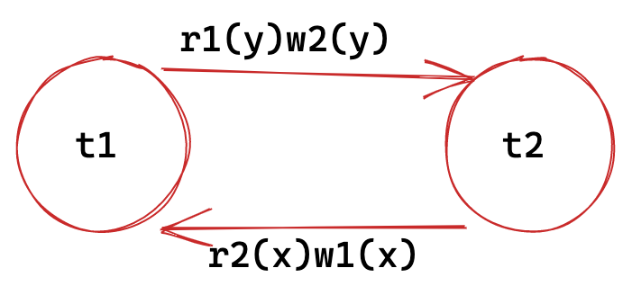

A schedule is serializable iff there is no cycle in its serialization Graph.
]

???
Serialization Graph 中，每个冲突是个单向的边，从先执行冲突项的事务指向后指向的事务。
如果 Serialization Graph 有环表示这个调度不是 Serializable 的。

一条边从t1指向t2表明，调度应该等效于t1在t2之前执行。这就构成了一种依赖关系。
???

---
layout: true
### Snapshot Isolation

---

**wr-dependency**:
.center[


t1 commits before t2 starts
]

--

**ww-dependency**:
.center[


t1 commits before t2 starts
]

--

???
这两个依赖的事务在时间上满足依赖要求的先后顺序。
???

---

**rw-dependency**:
.center[
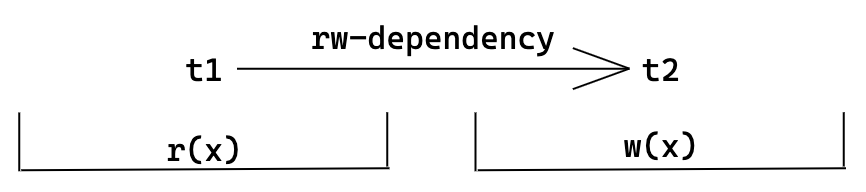

t1 commits before t2 starts
]

--

.center[
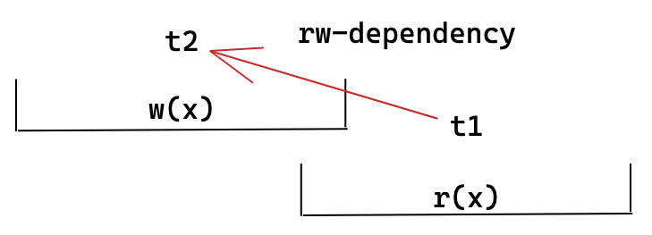

t1 and t2 are concurrent (.red[rw-anti-dependency])
]

???
anti-dependency 可能是逆时间顺序的，必须是并发的两个事务才有这种依赖。
???

---

- In SI, if there is some $T_m \rightarrow T_n$ dependency,
and that $T_m$ and $T_n$ are concurrent, we can conclude that $T_n  \stackrel{rw}{\rightarrow} T_n$.

--
.center[


]
--

???
普通的dependency 不会导致环，因为它们是按照时间有序的，只会一直指向时间往后的方向。
要形成环，需要“往回指”，只有 rw-anti 才能往回指。

而且一个 rw-anti 是不够的
???

In every cycle there are three consecutive txns $T_1, T_2, T_3$
(where it is possible that $T_1$ and $T_2$ are the same txn)
such that $T_1$ and $T_3$ are concurrent, with an edge $T_3 \rightarrow T_1$,
and $T_2$ and $T_3$ are concurrent with an edge $T_2 \rightarrow T_3$.

???
要从t1形成一个环回到t2，t1 和 t2 之间是普通的dependency，
那么必定至少有两个连续的anti-dependency
???

---

- For SI, any cycle must have at least two consecutive rw-anti-dependency edges.

.center[
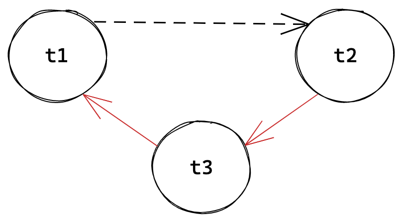</img>

Generalized dangerous structure
]

???
只有有了这个dangerous structure才会可能出现环。
???

--

Serializable Snapshot Isolation:
- detect dangerous structures,
- and then abort one of the txns involved.

---
layout:false

class: center, middle, inverse
## SSI: Serializable Snapshot Isolation

---
layout: true
## SSI

---
Avoid the necessary condition for cycles in SG

- detect two rw-anti-dependency edges that occur consecutively
- abort one of the involved txn
- .red[some txns can be aborted even if they are not in a cycle]

???
two consecutive rw-dependency 可能一定会导致环的产生，因为这是一个必要条件
conservative: 可能会 abort 掉一些不会形成环的事务
???

---

**Txn**:

  - inConflict: whether or not there is a rw-anti-dependency from a concurrent txn to this txn
  - outConflict: whether there is a rw-anti-dependency from this txn to a concurrent txn

???
in: 有一个边指向该事务
out：一个边从该事务指出
???

---

```
start(T):
  T.inConflict  = false
  T.outConflict = false
```

```
commit(T):
    if t.inConflict and t.outConflict:
        abort T
    else:
        commit T
```
--

.center[
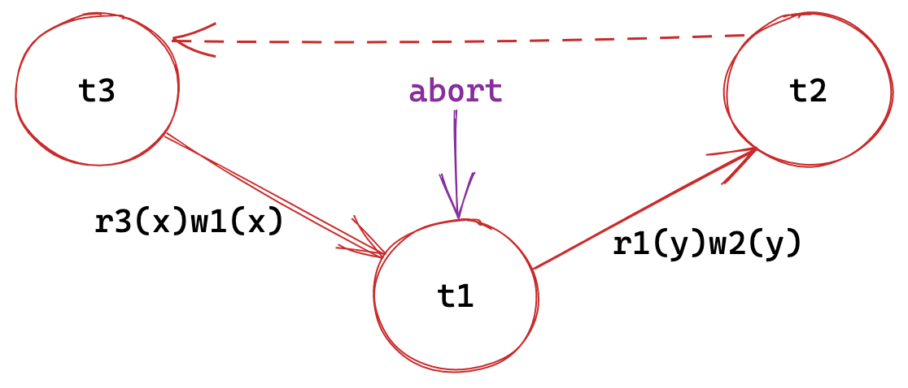 </img>

Aborted txn in `commit`
]

---

```
read(T, x):
    for each version (xNew) of x that is newer than what T read:
        if xNew.creator is committed and xNew.creator.outConflict:
            abort T
            return UNSAFE_ERROR
        xNew.creator.inConflict = true
        T.outConflict = true
    return what T read
```

???
会去看有没有新的版本可能形成rw-anti
它要去读，但是有一个新的版本（比它读的更加新的）写了，所以有一个 rw 的指出
???

--

.center[
 </img>

Aborted txn in `write`
]

???
t1 是 creator，当前事务是 t3，
t1.out = true
???

---

```
write(T, x, v):
    for each txn (TR) that reads x where
        TR.commit_timestamp > T.start_timestamp or TR is running:
        if TR is committed and TR.inConflict:
            abort T
            return UNSAFE_ERROR
        T.inConflict = true
        TR.outConflict = true
    write...
```
--

.center[
 </img>

Aborted txn in `read`
]

---
### Skew Write

.center[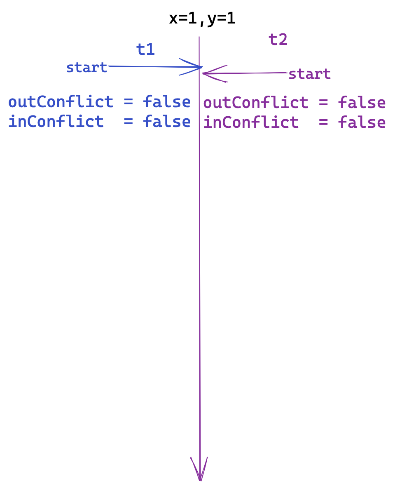 </img>]

---
count: false
### Skew Write

.center[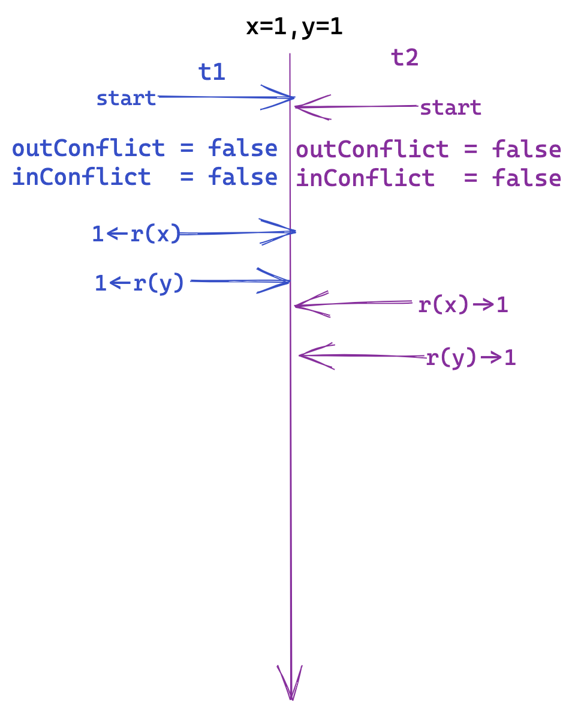 </img>]

---
count: false
### Skew Write

.center[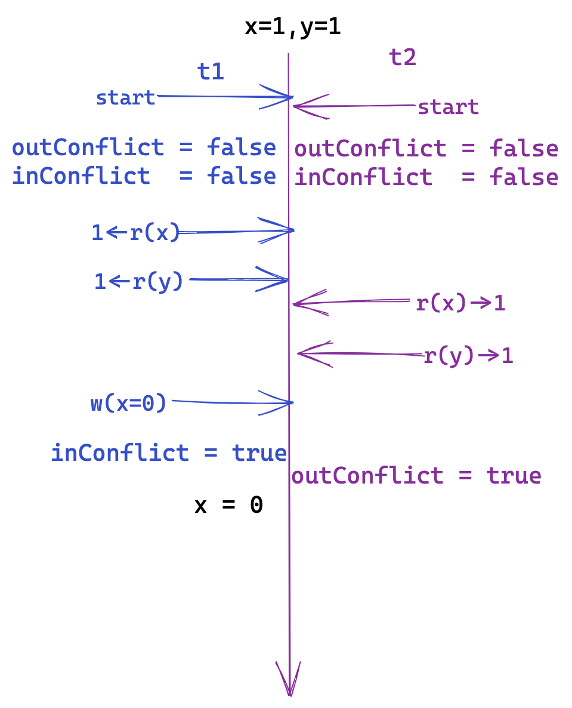 </img>]

---
count: false
### Skew Write

.center[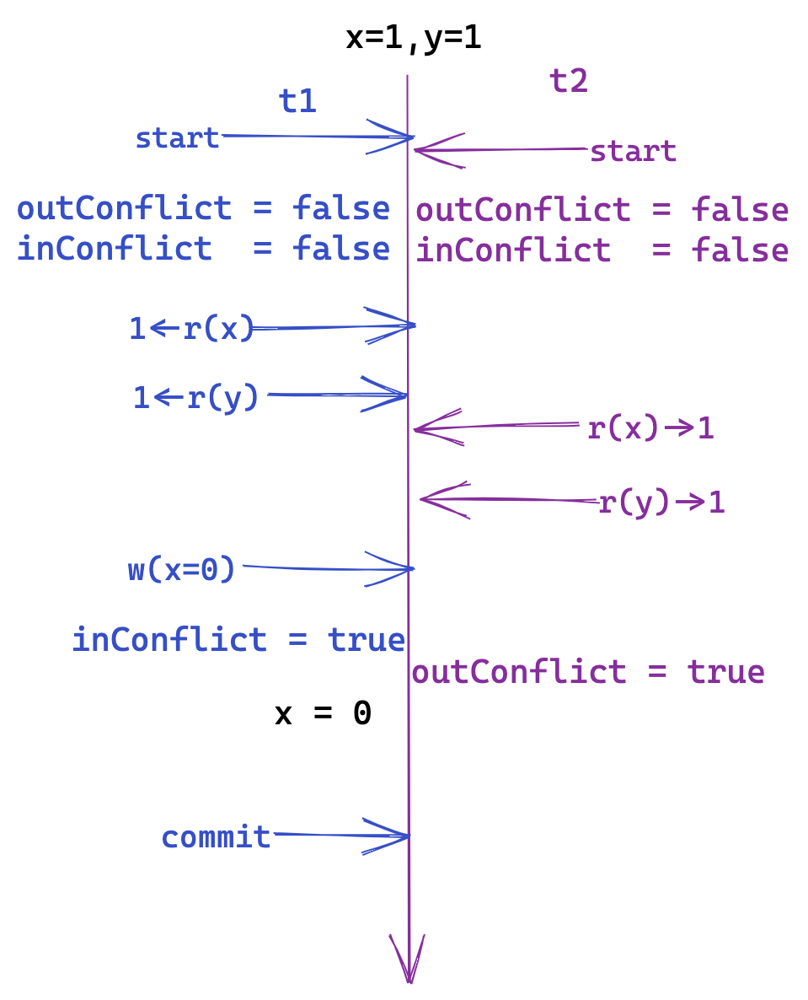 </img>]

---
count: false
### Skew Write

.center[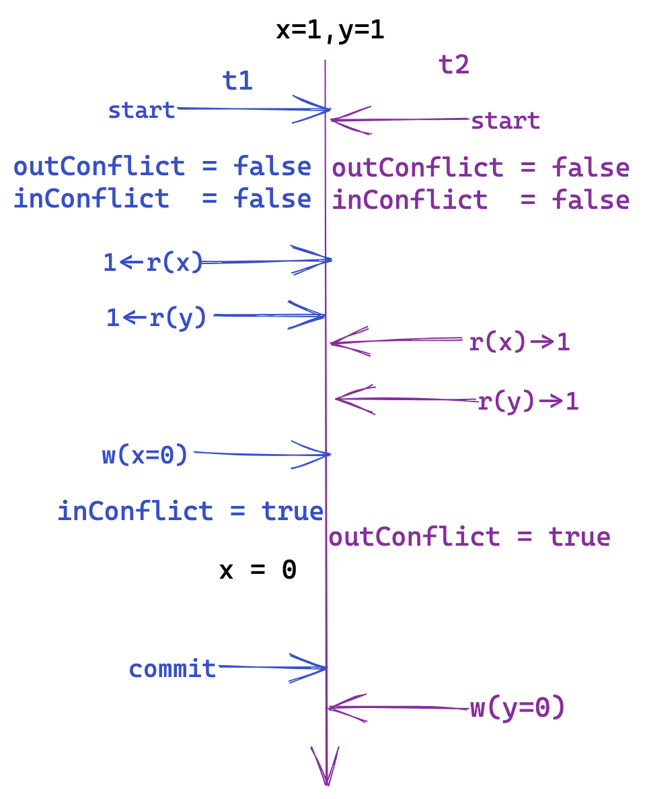 </img>]

---
count: false
### Skew Write

.center[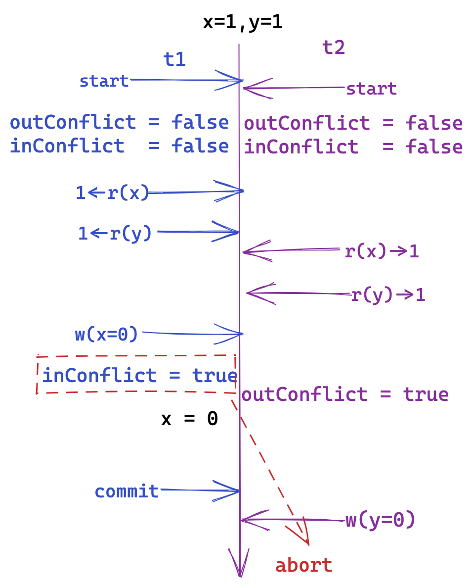 </img>]

---
### Read-Only Transactions

- SI:
  - read-only txns are never delayed because of concurrent txns’ writes
  - read-only txns never cause delays of write txns
- SSI:
  - read-only txns can be aborted and can abort write txns
  .center[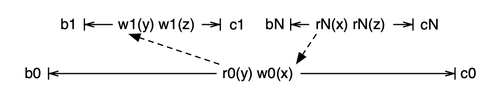]
  
  ???
  如果没有 N， 0-》1
  但是 N 只读到了 1 的结果
  N 读到的是1执行玩之后的一个snapshot，但是1，0之间的依赖需要满足0在1之前之前执行
  ???

---
count: false
### Read-Only Transactions

- SI:
  - read-only txns are never delayed because of concurrent txns’ writes
  - read-only txns never cause delays of write txns
- SSI:
  - read-only txns can be aborted and can abort write txns
  .center[]

???
posgres QL 的SSI方案： safe snapshot, 让只读等待一段时间到safe的阶段才去读
会增加一些额外的信息供检查使用。
???

---
layout: false
class: center, middle, inverse
## SSI   V.S.   MVTO

---
## SSI V.S. MVTO

都基于 MVCC，但是检测读写冲突的时机不一样：

- **SSI**：破坏 Serialization Graph 中可能形成环的条件
  - 事务执行整个过程中检查冲突
  - 判断冲突的信息主要在事务上

- **MVTO**： 事务提交时利用数据项上的读写时间戳检测读写冲突
  - 事务提交时检查冲突
  - 判断冲突的信息主要在数据项上

???
MVTO 更加适用分布化：判断冲突的信息本身是分布化的
???

  .center[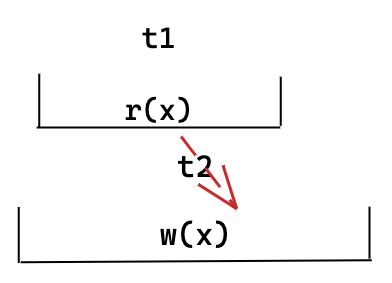]

???
SSI 不会abort， MVTO 会abort

SSI 的 abort 可能会更少：SSI 的读对写的影响不如 MVTO 那么大
???
