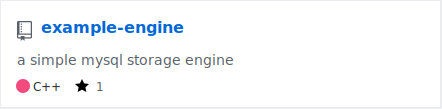

## 关于我

感谢你访问我的博客。我是杨韬，一名本科生，目前就读于电子科技大学。

这个博客托管在 GitHub Pages 上，静态页面生成器是我用 Python 写的 [blog-generator](https://github.com/yangtau/static-blog-generator)。

我的邮箱是 yanggtau **at** gmail **dot** com, 如果你有任何想与我交流的，请邮件联系我。

## 项目

